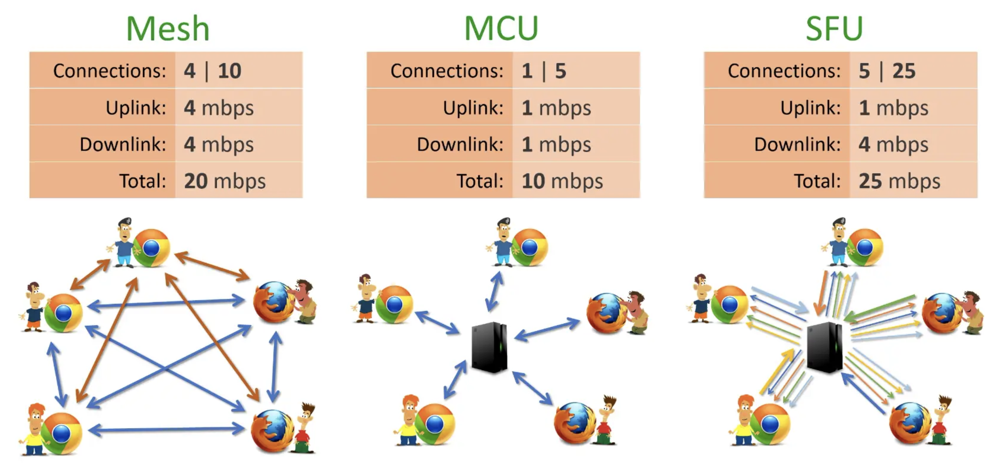
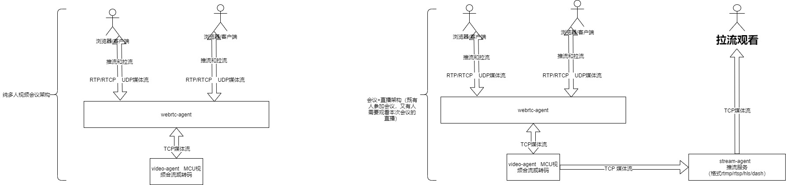

## MCU和SFU
OWT-Server架构基于MCU和SFU架构基础形式开发的流媒体服务。  
SFU和MCU的区别（如下图）

一、Mesh架构

每个端都与其它端互连。以上图最左侧为例，5个浏览器，二二建立p2p连接，每个浏览器与其它4个建立连接，总共需要10个连接。如果每条连接占用1m带宽，则每个端上行需要4m，下行带宽也要4m，总共带宽消耗20m。而且除了带宽问题，每个浏览器上还要有音视频"编码/解码"，cpu使用率也是问题。 

优点：开发简单，只需要建立对等p2p连接，而且没有中心节点，少一次数据报文的转发延迟，延迟最低。 建议局域网可以使用此模式。

缺点：广域网的p2p连接，不稳定。多人会议时，终端需要拉多路流进行解码运算，故终端性能也非常有限。一般也只能支持10人以内的局域网环境。。

二、MCU (MultiPoint Control Unit)

每个浏览器仅与中心的MCU服务器连接，MCU服务器负责所有的视频编码、转码、解码、混合等复杂逻辑，每个浏览器只要1个连接，整个应用仅消耗5个连接，带宽占用(包括上行、下行）共10m，浏览器端的压力要小很多，可以支持更多的人同时音视频通讯，比较适合多人视频会议。但是MCU服务器的压力较大，需要较高的配置。

优点：带宽占用最小，客户端只需要对合流（被服务器合并成一个流）后的帧数据编解码，大大降低终端的性能消耗。 

缺点：MCU合流服务器压力大，可以通过加强服务器编解码的硬件部分，和 负载均衡  来加强服务器性能。相比较Mesh模式，会多一次中心服务器数据转发延迟（大约50ms左右）

三、SFU(Selective Forwarding Unit)

中心节点只负责转发，不做太重的处理，服务器的压力会低很多，配置也不象MUC要求那么高。但是每个端需要建立一个连接用于上传自己的视频，同时还要有N-1个连接用于下载其它参与方的视频信息。所以总连接数为5*5，消耗的带宽也是最大的，如果每个连接1M带宽，总共需要25M带宽，它的典型场景是1对N的视频互动。

优点：通过特定的sfu服务器的广域网 通信，任何终端都可推流和拉流。

缺点：跟p2p缺点基本一样，带宽占用高，每拉一次流，都得对其解码，解码次数取决于拉了几次流，显然这么多的解码，终端的性能也会达到极限。一般也支持10人以内会议业务。

## OWT架构

`OWT-Server` 可同时支持SFU、MCU两种模式。 

owt启动时，会以类似微服务的架构形式启动1个或多个agent，并且每个agent都被cluster-manager管理，以到达高可用和负载均衡，以及各个agent负责对应的流媒体数据处理。。  

启动如下组件：

 **OWT分布式服务器组件**
组件名|部署数量|服务说明
--------|--------|--------
management-api|1 or 多个|对外API访问接口，主要功能有：创建/删除/修改房间，生成和验证令牌。可以部署多个来实现负载均衡
cluster-manager|1 or 多个|集群管理器，根据agent.toml配置文件的集群策略 分配请求到不同的节点，负载均衡和高可用
portal|1 or many|信令服务器，nodejs 以 websocket长连接的形式完成信令sdp交换的服务
conference-agent|1 or 多个| 会议房间控制
webrtc-agent|1 or 多个|直接与客户端建立udp Peerconnection链接，底层通过rtp（UDP）协议进行数据传输
streaming-agent|0 or 多个|将房间的媒体流，以rtmp/rtsp的协议，向CDN或者其他终端 进行数据推送
recording-agent|0 or 多个|媒体流本地持久化录制
audio-agent|1 or 多个|音频转码和混合
video-agent|1 or 多个|视频转码和混合
analytics-agent|0 or many|流媒体数据分析
sip-agent|0 or 多个|信令处理节点
sip-portal|0 or 1个|初始化会议室的sip配置，并调度sip处理节点为会议室提供服务
app|0 or 1个|提供参考的web demo案例页面，通过https://192.168.72.140:3004 访问
management-console|0 or 1个|用于会议管理的web控制台 https://192.168.72.140:3300/console

