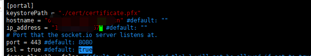

## Open WebRTC Toolkit Media Server

Owt-Server流媒体服务器，提供了基于Webrtc的高性能实时视频会议和流媒体服务技术，它能通过cluster_manage管理集群，自动完成负载均衡和高可用的分布式功能。同时Owt-Server提供了可选的流媒体实时分析插件模块，用户安装官方内置的如人脸识别，智能教室-手势识别等插件，也可以自行对接官方插件接口，完成实时的视频流的动态分析。OWT特点如下：

- 分布式，可扩展且可靠的SFU + MCU服务器
- 英特尔®酷睿™和英特尔®至强®处理器上的高性能VP8，VP9，H.264和HEVC实时转码
- 支持大多数流媒体协议，包括WebRTC，RTSP，RTMP，HLS，MPEG-DASH
- 高效混合高清视频流，以节省移动设备的带宽和性能
- 适应不同网络环境的智能服务质量（QoS）控制机制
- 自定义的流媒体分析插件，实时的计算机视觉分析

### OWT-Server 最新github master主干代码编译安装，单机部署安装
#### 一、服务器系统
1. Ubuntu 18.04(本次安装使用该系统，系统下载链接http://old-releases.ubuntu.com/releases/18.04.4/ubuntu-18.04-server-amd64.iso)
2. CentOs 7.6（已验证安装成功，但是需要升级默认gcc4.8到gcc7.5版本，不升级会有编译错误，安装失败）

#### 二、Ubuntu 18.04系统环境准备
依次执行下面命令：
1. `apt-get update`
2. `apt-get install autoconf automake  autoconf make git wget pciutils cpio libtool lsb-release ca-certificates pkg-config zlib1g-dev nasm yasm m4 autoconf libtool automake cmake libfreetype6-dev libglib2.0-dev liblog4cxx-dev libboost-system-dev python  net-tools`  

#### 三、设置服务器代理
owt部分webrtc客户端源代码和c/c++的库，需要访问谷歌地址。受国内防火墙限制，所以建议直接在国外服务器上面完成安装，或者使用代理软件  
国内安装的话，需要配置国外代理 

编辑 `vim /etc/profile` 

``` shell
export http_proxy=http://192.168.100.234:1080 
export https_proxy=http://192.168.100.234:1080 
export ftp_proxy=http://192.168.100.234:1080

source /etc/profile
```
 
#### 四、源码编译安装
1. 最新的OWT已升级node8.5到 10 版本 所以先安装 node10  

    ``` shell
    wget https://nodejs.org/dist/v10.13.0/node-v10.13.0-linux-x64.tar.xz
    tar xf node-v10.13.0-linux-x64.tar.xz
    vim /etc/bash.bashrc
    export PATH=$PATH:/root/node-v10.13.0-linux-x64/bin
    
    source /etc/bash.bashrc
    ```

2. 克隆官方最新代码 `git clone https://github.com/open-webrtc-toolkit/owt-server.git`

3. 非交互式（不需要手动输入Y确认步骤）安装owt依赖 `cd owt-server && scripts/installDepsUnattended.sh`  或者  交互式安装 `cd owt-server && scripts/installDeps.sh`

4. 编译owt源代码 `scripts/build.js -t all --check`

5. 官方提供的网页版的案例程序，也需要下载安装，步骤如下： 

    ``` shell
    #切换到~目录
    cd ~
    git clone https://github.com/beijing-penguin/owt-client-javascript
    cd owt-client-javascript
    npm install -g grunt-cli
    npm install  && cd scripts && grunt
    ```

6. 上述步骤安装完成后，回到owt-server源码目录，打包nodejs和生产可运行的二进制代码，默认可运行代码放在~/owt-server/dist目录 

    ``` shell
    cd ~/owt-server
    scripts/pack.js -t all --install-module --app-path ~/owt-client-javascript/dist/samples/conference
    ```

7. 启动OWT
如果有外网IP，则需要如下配置：（如果内网ip访问和验证，则不需要下面的配置，直接使用内网IP：192.168.X.X就可以）

    1. 设置服务器的公网IP，编辑` vim ~/owt-server/dist/webrtc_agent/agent.toml` ，修改 [webrtc] 部分的 network_interfaces
        {name = "eth0", replaced_ip_address = "你的公网IP"}（需要把 name 设置为网卡实际名称，replaced_ip_address 设置为服务器公网 IP 地址）
        
        <p align="center"></p>
    
    2. 编辑 `vim ~/owt-server/dist/portal/portal.toml` ，修改 [portal] 部分里的 ip_address 为服务器公网 IP 地址
        <p align="center"></p>
        
8. 关闭防火墙，OWT需要通过UDP端口进行视频通信，需要关闭防火墙 或者配置UDP 端口 防火墙规则。

    1. 关闭防火墙`ufw disable`
    2. 如果配了防火墙规则，则需要修改如下配置
    ```
    vim ~/owt-server/dist/webrtc_agent/agent.toml
    # The webrtc port range
    maxport = 40000 #default: 0
    minport = 35000 #default: 0
    ```

9. 启动： 

    ``` shell
    cd ~/owt-server
    (cd dist && ./bin/init-all.sh && ./bin/start-all.sh)
    ```


10. 验证

    1. 浏览器先访问，获取ca证书
        <p>https://IP地址:8080/socket.io/?EIO=3&transport=polling&t=N2UmsIn</p>
    2. 再访问
        <p>https://IP地址:3004</p>
        <p align="center"></p>